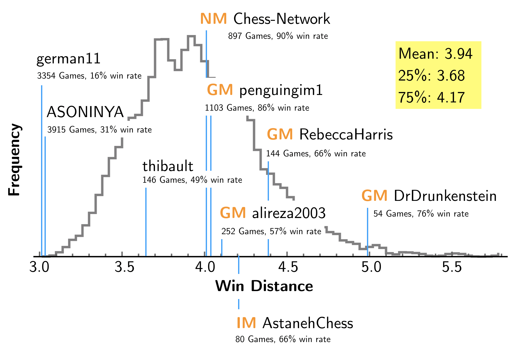

# Lichess Distance Calculator
Calculate your win separation from the World Champion (and others) on Lichess. That is, you can find out who you beat, that beat someone, that beat someone, that beat Magnus in the October Titled Arena.
That is: 
```
1: You beat them
2: You beat someone who beat them
3: You beat someone who beat someone who beat them
4: You get the drift
```
Right now, I only use all the games from October-- sorry!
In the coming weeks, I'll try to get a solution with all games. However, if you played in October you can pretty easily calculate an upper bound on your win distance.

## Misc:
https://lichess.org/blog/W9S8FRYAADAADOzT/magnus-ascendant-in-titled-arena-8

https://lichess.org/tournament/7cFYtxgA

# To run the code
Download this file: https://www.dropbox.com/s/qht5r40z9msz5ed/2018-10-ALL.pkl.zip?dl=0 (290 MB ZIP file generated by `import-pgn-speed.py`) or clone it from this repository. For the raw data, go to https://database.lichess.org. 
Unzip the `2018-10-ALL.pkl.zip` file to th directory with the code. Then, using python3 open the `Lichess_Distance.ipynb` file. You will need to install `networkx`. 


